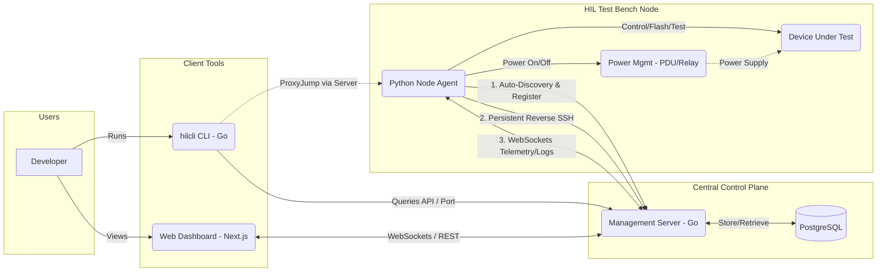

# Hardware-in-the-Loop (HIL) Test Bench Infrastructure
## Architecture Design Document

### Overview
This document outlines a scalable, fully open-source, self-hosted software architecture for managing Hardware-in-the-Loop test benches. The design separates concerns into a centralized control plane (the manager) and distributed data planes (the test nodes), allowing for dynamic scaling, real-time monitoring, and remote access across geographically distributed networks.

### High-Level Architecture Diagram

---

### 1. Centralized Management Server (Control Plane)
The web server acts as the central hub for all testing nodes, aggregating their status, assigning ports, and providing user interfaces.

*   **Backend Framework**: **Go (Golang)**. Handles high concurrency (thousands of simultaneous WebSocket streams) effortlessly, uses minimal resources, and compiles into a single deployable binary.
*   **Database**: **PostgreSQL**. A robust relational database to store node metadata, assignment status, test history, power configurations, and reverse SSH port assignments.
*   **Real-time Broker**: **WebSockets**. Used to stream real-time telemetry (online/offline status, current power draw, test progress logs) directly from the nodes to the web client.
*   **Web Interface (Frontend)**: **Next.js (React)**. A Single-Page Application (SPA) providing a comprehensive dashboard of all test benches and their states. It dynamically polls the API (to be upgraded to true event-driven WebSockets in future iterations) and abstracts all port mapping and registry tracking into visual status cards.

### 2. HIL Bench Node Agent (Data Plane)
On each Linux machine connected to a DUT, a lightweight background service runs.

*   **Technology**: **Python 3**. Python is natively integrated with test scripts and has unmatched libraries (`pyserial`, `pyusb`) for communicating with hardware controllers. It runs as a `systemd` background service.
*   **Responsibilities**:
    *   **Auto-Discovery**: On boot, registers itself with the central server API.
    *   **Tunneling**: Establishes a persistent `autossh` reverse tunnel to the central server using its dynamically assigned port.
    *   **Telemetry**: Constantly sends a heartbeat and bench health status to the server over WebSockets.
    *   **Hardware Control**: Abstracted interface to trigger the power module.
    *   **Test Runner**: Executes specific Python test scripts and streams `stdout`/`stderr` logs back to the server.

### 3. Hardware Controller (Power Management)
To control power to geographically distributed hardware, an abstraction layer in the Python Agent allows for multiple hardware plugins:
*   **For high-voltage/AC devices**: **Networked PDUs (e.g., Digital Loggers Web Power Switch)**. Expose a simple REST API that the Python agent can call.
*   **For low-voltage/DC devices**: **USB Relay Modules** (e.g., generic FTDI-based relay boards). Plug directly into the Linux machine via USB and are controlled via serial commands.

### 4. Communication, Networking & Security
Because nodes are geographically distributed and the infrastructure must be fully self-hosted, remote access relies on **Centralized Reverse SSH** managed entirely by the platform.

*   **Node Tunneling**: When a node boots, the Python agent registers with the Go Server. The server assigns it an available SSH port in the PostgreSQL registry. The Python agent then starts `autossh`, creating a reverse tunnel linking the central server to the node's local port `22`.
*   **User Routing**: When a developer connects via the `hilcli` tool, the CLI queries the Go API for the specific node's assigned port. The CLI transparently executes a native SSH `ProxyJump` command in the background. 
*   **Security & Benefits**: 
    1. Zero 3rd-party dependencies, proprietary control planes, or VPN clients.
    2. Developers are abstracted away from managing port mappings. 
    3. Built entirely on standard, battle-tested `sshd` and `autossh` daemons.

### 5. User CLI (`hilcli`)
A unified command-line interface for the developers.

*   **Technology**: **Go (Golang)**. Distributed as a single, fast compiled binary to Mac, Windows, and Linux users without needing virtual environments.
*   **Features**:
    *   `hilcli list` - Queries the central API and prints a table of all available benches.
    *   `hilcli connect <bench-name>` - Automatically queries the Postgres registry for the routing port, establishes the ProxyJump, and drops the user into an SSH session.
    *   `hilcli power <bench-name> [on|off|cycle]` - Sends an API request to remotely power cycle the DUT.
